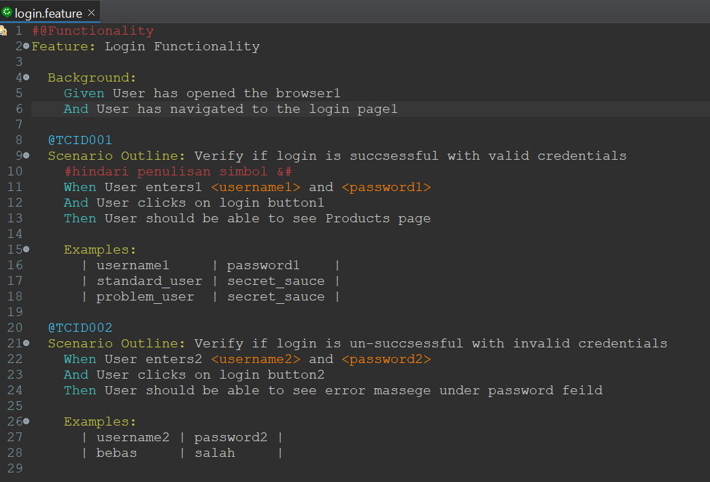
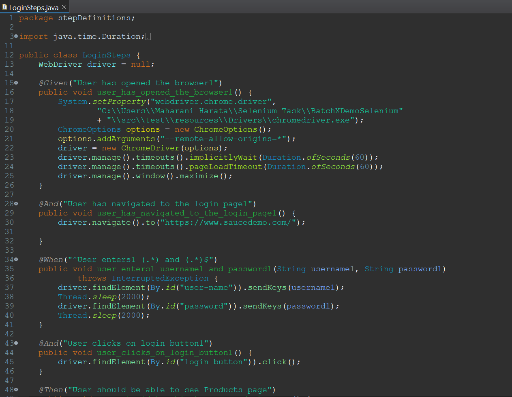
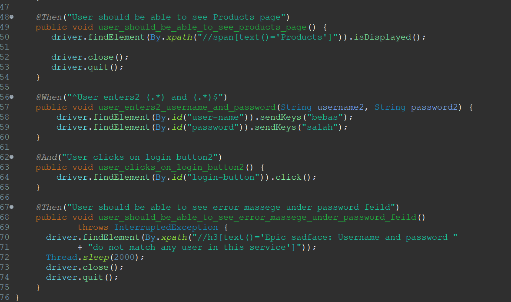

# Soal test maggang Quality Assurance engineer

Berikut adalah soal/pertanyaan yang perlu dijawab oleh peserta

## knowledge base

1. Apa yang anda ketahui tentang Rest API? *Jawaban*: Rest Api adalah jenis APi web yang menggunakan permintaan HTTP untuk melakukan operasi CRUD pada data. Rest API sendiri memiliki 4 metode HTTP utama yang digunakan dalam yaitu GET, POST, PUT, dan DELETE
2. Apa yang anda ketahui tentang Server side and Client side processing?*Jawaban* : Client-side development atau dapat dikenal dengan frontend develepment yang berfokus pada pembuatan bagian-bagian web sehingga wab dapat berinteraksi dengan pengguna..Sedangkan Server-side development atau dapat di kenal dengan backend development yang melibatkan program yang berjalan pada sebuah server dimana untuk pengguna dapat berberinteraksi dengan server untuk mengambil informasi.
3. Apa yang anda ketahui tentang Monolith dan Microservices, berikan contohnya?*Jawaban* : Monolith dan microservices merupakan 2 pendekatan dalam pengembangan perangkat lunak yang menjadi perbedaan dari keduanya adalah untuk monolith dibangun sebagai satu entitas tunggal dan akan diintegrasikan dalam satu kode sumber contoh : Laporan keuangan, sedangkan micreservices dipecah menjadi beberapa unit independen, unit yang dipecah akan menjalankan setiap proses dengan layanan yang terpisah. contoh penggunaan media sosial dimana pembagian dari 1 aplikasi dapat melakukan pengelolaan profil dan lain lain
4. Apa yang anda ketahui tentang Automation testing serta sebutkan contohnya? *Jawaban*: Automation Testing adalah pengujian yang membutuhkan alat atau tools untuk menjalankan perintah yang sebelumnya dibuat secara manual
Contoh automation testing menggunakan Selenium 

 

5. Dengan menggunakan tools automation testing tersebut, biasanya menggunakan bahasa/tools apa? *Jawaban* : Beberapa tool yang pernha digunakan untuk melakukan automation testing yaitu Katalon,Selenium menggunakan java, playwright menggunakan javascript, dan Robot menggunakan python.

## Use cases

Suppose there was a transaction that had been done in tokopedia.com , the transaction
id should be available on the screen alongside with the address of shipment, date of
order, seller’s name, and delivery service (JNE/POS/REX/others). 
The transaction id (TRX_ID) should also be available on the database which again supposedly there was a simple table containing all the transaction data.

Apparently, the order `01023A9AC` seems to have different Delivery Service on the UI and the
database record. How do you, as automation test developers develop such test scenario so that
this kind of error does not occur?

*Jawaban*
**Use Case**
Scenario : Melakukan Vertifikasi Data Transaksi pda database dan UI cocok							
							
Steps:							
1. Kunjungi laman Tokopedia.com							
2. Login menggunakan akun yang sudah terdaftar							
3. Klick Transaksi 							
4. Sistem akan menampilkan detail data transaksi dibawah ini:
    - ID Transaksi :
    - Nama Penjual :
    - Layanan Pengiriman : 
    - Tanggal Pesanan :
    - Alamat pengiriman :"""							
5. membuka database transaksi							
6. lakukan perbandingan data pada database dengan data yang di tampilkan pada web							

Pengujian ini bertujuan untuk memastikasn detail transaksi yang ditampilkan dengan data transaksi yang tersimpan pada database cocok 							